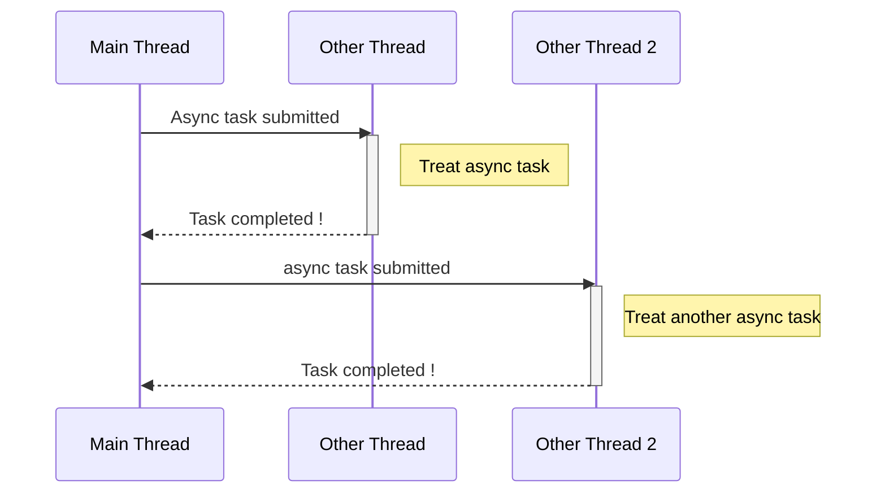
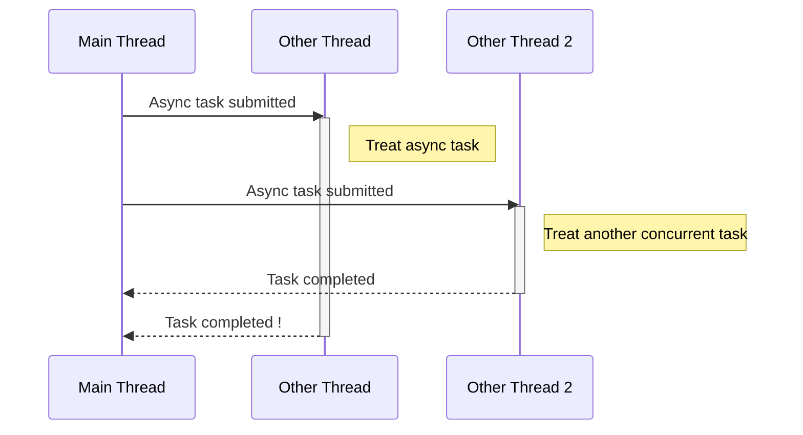
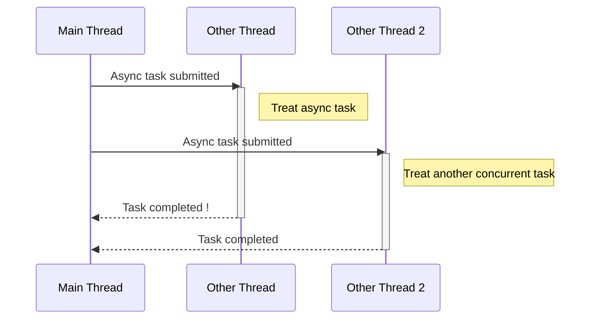

<h1 align="center">Déroulé de l'atelier 🏁</h1>

## Pourquoi écrire du code concurrent ❓
Ce paradigme de programmation est bien connu des développeurs front.<br/>
Il est inenvisageable d'effectuer des appels bloquants depuis un site ou une application web sans utiliser des Promise ou Observable !<br/>
Pendant longtemps, les applications java étaient déployées sur des VM on prem. Les développeurs se souciaient donc peu des ressources consommées.<br/>
On mettait beaucoup de RAM et beaucoup de CPU sans trop se pencher sur l'implémentation.<br/>

La situation a changé à l'air du Cloud, le CPU et la RAM coûtent cher et nous déployons nos applications sous forme de micro-services.<br/>
Le principal avantage de ce paradigme est qu'il est <b>natif</b> en Java !<br/>
<b>Les API disponibles nous permettent donc d'optimiser nos ressources réservées sur un cluster et de consommer peu de CPU et de mémoire</b>.

## Programmation asynchrone ⏳

La programmation asynchrone consiste à exécuter une tâche dont le résultat produit se situe dans le futur,<br/> et ce, sans bloquer le thread principal de l'application.


## Programmation concurrente 🚄

La programmation concurrente consiste à "paralléliser" l'exécution de plusieurs tâches.<br/>
Cela ne signifie pas pour autant que nos tâches sont réellement exécutées de manière parallèle...<br/>
En réalité, les tâches vont être positioner sur plusieurs threads et le thread principal switchera de thread en thread entre chaque cycle d'exécution.<br/>
Ces cycles sont exprimés en GHz (en nos temps modernes 🙂), ainsi 2GHz signifie 2 milliards d'opérations par seconde.<br/>



## Thread ? 🤔

Que l'on parle de Thread OS, Thread Platform, Carrier Thread, il signifie tous la même chose !<br/>
La JVM crée elle-même pour ses propres besoins plusieurs threads : le thread d'exécution de l'application, un ou plusieurs threads pour le Garbage Collector...<br/>
Le système d'exploitation va devoir répartir du temps de traitement pour chaque thread sur le ou les CPU de la machine.<br/>
Plus il y a de threads, plus le système va devoir switcher. De plus, un thread requiert des ressources pour s'exécuter notamment un espace mémoire nommé pile.<br/>
Il est donc nécessaire de contrôler le nombre de threads qui sont lancés dans une même JVM.

<b>1 Thread Platform ~=1-2Mo</b>

### Historique 📖
#### Java 1 Thead !
````java
        var dillyMutable = new DillyMutable();
        var pref = apis.fetchPreferences();
        var t1 = new Thread(() -> dillyMutable.setBeer(apis.fetchBeer(pref)));
        var t2 = new Thread(() -> dillyMutable.setVodka(apis.fetchVodka()));
        t1.start();
        t2.start();

        try {
            t1.join();
            t2.join();
        } catch (InterruptedException e) {
            throw new RuntimeException(e);
        }
        return new Dilly(dillyMutable.getBeer(), dillyMutable.getVodka());
````
❌ Gaspillage: crée de nouveaux threads pour chaque demande<br/>
❌ Etat des mutations : risque de bugs / blocages protégeant les mutations (deadlocks)<br/>
❌ Risque de Out of Memory<br/>

#### Java 5 ExecutorService 😃
````java
        ExecutorService executor = Executors.newFixedThreadPool(200);
        
        var dillyMutable = new DillyMutable();
        var done = new CountDownLatch(2);
        
        var pref = apis.fetchPreferences();

        // i await for 2 responses

        executor.execute(() -> {
            dillyMutable.setBeer(apis.fetchBeer(pref));
            done.countDown();
        });
        executor.execute(() -> {
            dillyMutable.setVodka(apis.fetchVodka());
            done.countDown();
        });
        try {
            done.await();
        } catch (InterruptedException e) {
            throw new RuntimeException(e);
        }

        return new Dilly(dillyMutable.getBeer(), dillyMutable.getVodka());
````
✅ Réutilise les threads <br/>
❌ Etat des mutations : risque de bugs / blocages protégeant les mutations (deadlocks)<br/>

#### Java 7 Future 😎
````java
        try (var executors = Executors.newFixedThreadPool(200)) {

            var preferencesFuture = executors.submit(apis::fetchPreferences);
            var beerFuture = executors.submit(() -> apis.fetchBeer(preferencesFuture.get()));
            var vodkaFuture = executors.submit(apis::fetchVodka);

            return new Dilly(beerFuture.get(), vodkaFuture.get());

        } catch (ExecutionException | InterruptedException e) {
            throw new RuntimeException(e);
        }
````
✅ Style fonctionnel : les opérations asynchrones renvoient des valeurs, ne changent pas d'état <br/>
❌ Bloque le thread principal

#### Java 8 CompletableFuture, les Promise de Java 😍 
````java
            return CompletableFuture.supplyAsync(apis::fetchPreferences)
                .thenApply(apis::fetchBeer)
                .thenCombine(CompletableFuture.supplyAsync(apis::fetchVodka), Dilly::new)
                .join();
````
✅ Style fonctionnel : les opérations asynchrones renvoient des Monades (CompletableFuture), ne changent pas d'état <br/>
✅ Pipeline fonctionnel à l'image de l'API Stream et Optional <br/>
✅ Ne bloque pas le thread principal tant que join() ou get() ne sont pas appelées <br/>
❌ Peut être compliquée à prendre en main (API riche)

## Nouvel ordre 👨‍✈️

### Java 21 VirtualThread 🌊
````java
return CompletableFuture.supplyAsync(apis::fetchPreferences, executorService) //Executors.newVirtualThreadPerTaskExecutor()
        .thenApply(apis::fetchBeer)
        .thenCombine(CompletableFuture.supplyAsync(apis::fetchVodka, executorService), Dilly::new)
        .join();

````
### Java 23 Structured Concurrency ? (preview 21 et 22) 🔥
````java
var preferencesFuture = executorService.submit(apis::fetchPreferences); //Executors.newVirtualThreadPerTaskExecutor()

try (var scope = new StructuredTaskScope.ShutdownOnFailure()) {

    var beerTask = scope.fork(() -> apis.fetchBeer(preferencesFuture.get()));
    var vodkaTask = scope.fork(apis::fetchVodka);

    scope.join().throwIfFailed();

    return new Dilly(beerTask.get(), vodkaTask.get());
} catch (InterruptedException | ExecutionException e) {
    throw new RuntimeException(e);
}
````